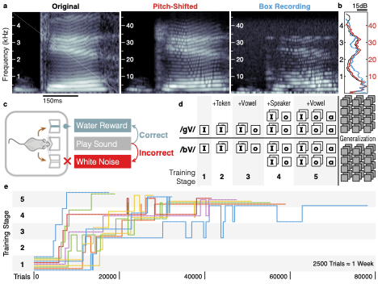

# Outline

- **Phonetic Perception** - Behavioral, neurophysiological, and theory in a mouse model
	- **Feb - March:** Build Behavioral Apparatus
	- **April - May:** Complete theory section for future paper, scaffold analysis strategy
- **Autopilot** - Software engineering, STS, interface design for naturalistic neuroscience
	- **April - May:** Revise Preprint and submit to eLife
- **Infrastructure** - Information science, social organizing, investigative journalism to combine disparate threads of scientific systems agitation.
	- **April - May:** Revise draft manifesto and submit as preprint/live document.

---

# Phonetic Perception

- Train mice to discriminate between consonant-vowel pairs starting with /b/ or /g/
- Gradually increasing complexity
- Test generalization with novel sounds

---

# They can do it, but how?

## TODO:

- Finish theoretical background & model building
- Lay groundwork for behavioral experiment on mesoscope & analysis

---

# Autopilot

---

# Infrastructure

